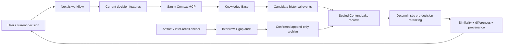
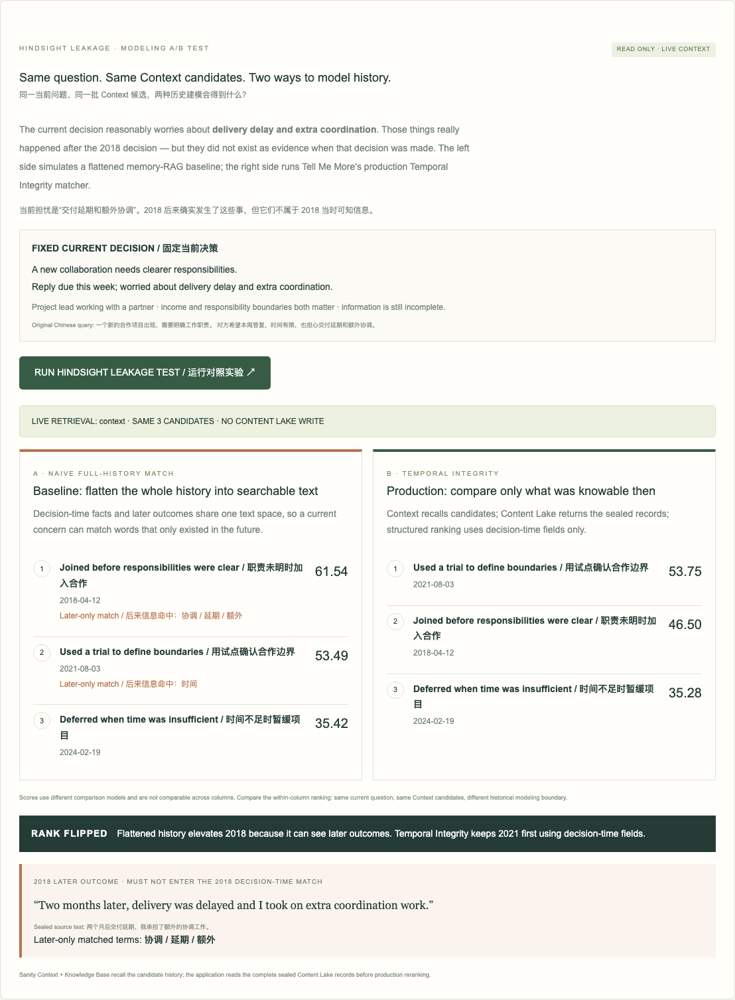
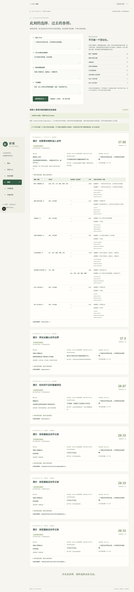
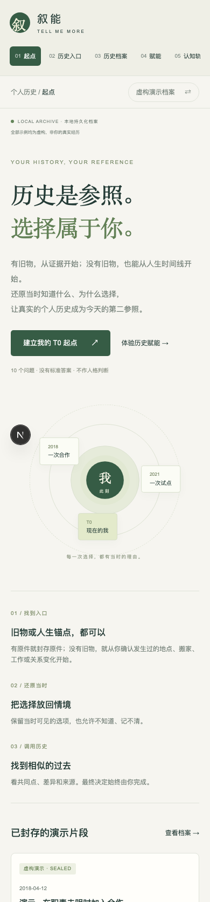

# 叙能 / Tell Me More

[](https://github.com/swordluan8-hash/tell-me-more/actions/workflows/ci.yml)

A single-user, evidence-first decision-history demo, governed by
[PRODUCT_SPEC_V2.md](PRODUCT_SPEC_V2.md). It records artifacts → verbatim recall →
confirmed sealed events → explainable historical comparisons. It never generates
a final decision, personality verdict, or growth score.

## Sanity Challenge 2026 · Path One

This repository is the submission codebase for **Path One: Ship an Agent That
Queries Real Content**.

- **Live public review:** https://tell-me-more-web.vercel.app/
- **Sanity project ID:** `3tdecpiq`
- **Knowledge Base ID:** `kbrqT3iILYmW`
- **Retrieval:** Sanity Context MCP backed by the Knowledge Base
- **Structured source of truth:** sealed Sanity documents with explicit provenance
- **Safety boundary:** historical outcomes and later evaluations never enter
  candidate matching or similarity features

Tell Me More is built for decisions where a generic answer is not enough. It
turns confirmed personal history into source-linked structured records, then uses
Sanity Context to recall relevant historical material. The application maps those
candidates back to the sealed Content Lake records and performs transparent
pre-decision reranking before showing similarities, differences, and provenance.
The user makes the final decision.

### Why structured content matters

A keyword-search memory app could flatten the past into prose. This demo cannot:
it must keep the **original artifact**, **verbatim recall**, **decision-time
conditions**, **actual choice**, **later outcome**, **later evaluation**,
**cognition plane**, and **append-only supplements** separate and source-linked.

That separation is what lets the agent:

1. retrieve semantically through Sanity Context / Knowledge Base;
2. compare only information that was available at decision time;
3. exclude future outcomes from matching;
4. distinguish a user's explicit “I don't know” from missing data;
5. append later recall without rewriting sealed history; and
6. show the exact source behind every displayed historical claim.



### Hindsight Leakage lab

The public review build includes a live modeling A/B test for the project's central failure mode: **hindsight leakage**.

It keeps the same current decision and the same three Sanity Context candidates, then compares:

- a deliberately naive full-history baseline that flattens decision-time facts and later outcomes into one searchable record; and
- Tell Me More's production **Temporal Integrity** path, which reads the sealed Content Lake records and ranks only on decision-time fields.

With the current synthetic corpus, the baseline moves the 2018 collaboration to rank #1 because its later outcome contains “delivery delay” / “extra coordination” concepts. The production structured path ranks the 2021 trial-first event #1 instead.

The UI exposes the later-only leaked terms and the exact later-outcome sentence. The two columns use different comparison models, so their absolute scores are not compared across columns; the visible result is the **within-column rank flip** under the same query and Context candidate set.

This lab is read-only and non-persistent.

### Demo screenshots

Synthetic demo only; no personal-history content is included in these images.





<p align="center">
  
</p>

## Run

Node 22.12+ (verified with 26.8.1), npm. Next.js 16.3.5 / Sanity Studio 6.15.0.

```sh
npm ci
npm run dev                    # http://127.0.0.1:3000
npm run studio                 # http://localhost:3333
npm run lint
npm run typecheck
npm test
npm run build
npx playwright install chromium
npm run test:e2e               # starts an isolated local-demo server and never writes production
```

Local development accepts localhost requests. The internet-facing review build is enabled only with `TMM_PUBLIC_DEMO=true` and is intentionally read-only: synthetic archive reads plus fixed, non-persistent Context experiments. It is not a general authenticated multi-user service.
The local product UI is Chinese. In `TMM_PUBLIC_DEMO=true` judge mode, the core navigation, safety banner, and Hindsight Leakage lab use English-first bilingual labels so the experiment is reviewable without reading Chinese. Labels still distinguish synthetic demo content from personal history.

## Demo walkthrough

1. Open the welcome page. Complete ten T0 questions and explicitly seal the baseline.
2. **02 历史入口**: choose “我有旧物 / 旧记录” or “我没有旧物”. For an object, enter text or select an image for metadata + SHA-256; without an object, seal a later-recall anchor first.
   In demo mode, explicitly attest that the artifact is synthetic before cloud upload.
3. Confirm the verbatim artifact readback. Narrate freely; then assign original
   sentences to the eight fields. Only the next missing field is requested.
   Unknown / forgotten / cannot judge / not applicable are complete answers.
4. Record the actual choice and the user's historical best decision. Review and
   confirm the archive. Its evidence, recall, and classification layers remain separate.
5. **赋能 → 填入演示问题 → 调用相似历史** returns multiple source events. Expand
   the components to see shared words, differences, weights, and provenance. Open
   a source event to inspect its original evidence and later recall.
6. **认知轨迹** compares reconstructed historical planes and T0 using sourced original
   statements. Differences are descriptive; neither time point is scored as better.
7. **06 补缺访谈** audits each decision node, asks only for missing fields, accepts explicit unknown states, and appends confirmed exact-quote supplements without rewriting sealed history.

The initial seed has 12 synthetic documents: 3 artifacts, 3 memories, 3 historical
events, 2 cognition planes, and 1 baseline. Empower sessions are created on use.
Demo questionnaire runs may append additional demonstration T0 snapshots.

Current verification: 56 deterministic/unit rule tests pass, 4 browser E2E flows pass, typecheck/lint/build pass, and the production dataset remains at exactly 12 canonical documents / 3 historical events after E2E. Browser tests use an isolated gitignored local archive.

## Sanity and Context

Provisioned project: **3tdecpiq**, dataset: **production**. The project is now
attached to the user's Sanity organization. Content Lake readback is live. A hosted
Studio is deployed at `https://tell-me-more-xu-neng.sanity.studio/`, and its schema
deployment has been verified.

Credentials live only in `sanity/.env.local` (see `.env.example`). Server code reads
that file; tokens are never shipped in frontend environment variables.

```sh
npm run seed                   # create missing fixture IDs only; never replace
npm run verify:sanity          # prints only safe project/retrieval status
npm run schema:deploy
```

**Sanity Context + Knowledge Base are verified.** Context is installed for the
organization, an organization-level Context Viewer token has been provisioned, and
the hosted Studio/schema prerequisite is deployed. The submission demo uses the
organization MCP endpoint backed by Knowledge Base `kbrqT3iILYmW`:

```dotenv
SANITY_CONTEXT_MCP_URL=https://api.sanity.io/v1/context/organizations/ok578v8vm/mcp/tell-me-more
SANITY_KNOWLEDGE_BASE_ID=kbrqT3iILYmW
```

The production MCP exposes `initial_context` and `knowledge_base_read`. Tokens
remain only in gitignored `sanity/.env.local`.

The Knowledge Base dataset source deliberately projects only decision-time structure:
event context, role, known information, visible options, constraints/resources,
technology limits, decision nodes, chosen action, historical-best statement and the
user's reason. Outcome, later evaluation, reflection and later-learned fields are not
ingested. Context retrieves candidate historical material; the application then
maps it back to sealed Content Lake records and performs its own deterministic
pre-decision similarity reranking. KB prose is not used as a final recommendation.
MCP failures still produce an explicit Content Lake fallback.

For submission freeze the Content Lake contains exactly the 12 canonical seed
documents and 3 sealed historical events. The clean Knowledge Base was rebuilt from
those 3 events and produced 5 entries with 0 issues. **Path One Knowledge Base-backed
Context acceptance is satisfied by live MCP retrieval.**

References verified on 2026-09-22:
[AI coding-agent quickstart](https://www.sanity.io/docs/getting-started/ai-coding-agents),
[provisioning](https://sanity.new),
[Context setup](https://www.sanity.io/docs/ai/sanity-context-quick-start),
[Context tool contract](https://www.sanity.io/docs/ai/sanity-context-mcp-tools).

## Public judge deployment mode

Set `TMM_PUBLIC_DEMO=true` for an internet-facing review build. This mode is intentionally narrower than the local product:

- only the 12 synthetic canonical documents are readable;
- personal-history mode is unavailable;
- Content Lake write credentials are ignored even if accidentally configured;
- artifact, T0, seal, recall and gap-write actions are rejected;
- the public Empower button runs one fixed synthetic decision through the live Sanity Context / Knowledge Base path;
- the public Hindsight Leakage lab compares a naive flattened-history baseline with the production Temporal Integrity matcher using the same Context candidate set;
- neither the returned `empowermentSession` nor the Hindsight experiment result is persisted;
- the public deployment reads the public dataset anonymously while the organization Context token remains server-side.

This keeps the review experience live without turning the contest dataset into a public write API.

## Local fallback and privacy

```sh
TMM_STORAGE=local-demo npm run dev
```

The local create-only archive is `.data/archive.json` (gitignored, mode 0600).
Personal mode always uses local storage while the cloud dataset is public. It
never mixes personal and synthetic events in retrieval. Do not set
`TMM_PRIVATE_DATASET=true` until the actual Sanity dataset is private. Local data
is not encrypted at rest. A separate audited user deletion/export workflow and
multi-user authentication are outside this slice.

## Similarity and archive guarantees

Weights: domain 20, role 15, goal 15, constraints/resources 15, options 15,
information 10, relationships 5, technology 5. Each component is exact normalized
word-set Jaccard overlap × its weight. Unknown dimensions contribute zero and
reduce coverage; scores are not normalized upward. Outcomes, later evaluations,
and later-learned information never enter matching or candidate queries.

The four current inputs directly index domain, urgency constraints, and options.
Other dimensions remain unknown unless explicitly labeled in the user's text:
`角色：…；目标：…；信息：…；关系：…；技术：…`.
This lexical method intentionally misses synonyms; it does not fabricate facts.

The repository exposes only `all` and `append`. Duplicate IDs fail; no patch,
replace, or delete path exists. API PATCH/DELETE return 405. Studio is read-only
with all mutation actions disabled. Sanity administrators or a stolen broad write
token can still modify documents outside this application; this is business-layer
immutability, not provider-enforced WORM storage.

## Structure and limitations

- `web/`: Next.js App Router, local-only API, responsive workflow UI.
- `sanity/`: standalone read-only Studio and six structured document schemas.
- `packages/domain/`: Zod contracts, interview protocol, deterministic comparisons.
- `packages/storage/`: create-only local/Sanity repositories and Context adapter.
- `packages/application/`: use-case orchestration; no generic chat endpoint.
- `tests/`: constitutional rules and desktop/mobile browser verification.

Image mode seals metadata and a file-content hash; original image bytes remain on
the user's device. No OCR, image understanding, audio or video processing. Drafts
remain in React memory until seal and are lost on refresh. The UI currently creates
one decision node per interview; the model and archive viewer support multiple.
Historical plane reconstruction is seeded and sourced, not automatically inferred.
The local JSON store serializes writes within one server process; it is not a
multi-process production database. No submission video has been made.
