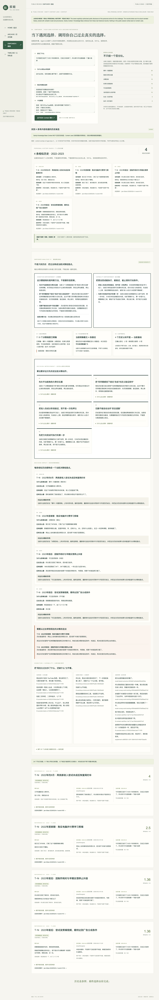
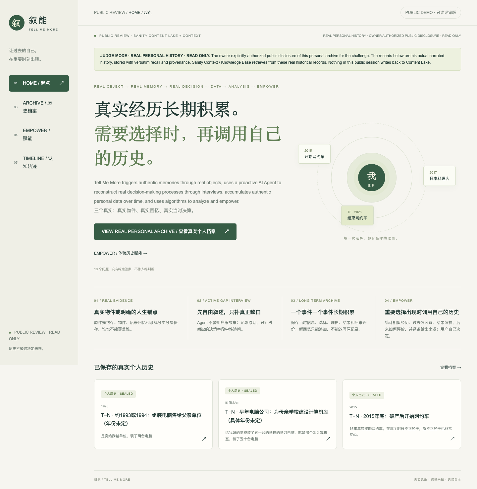
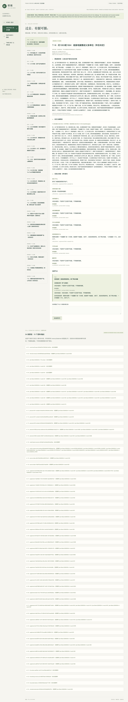
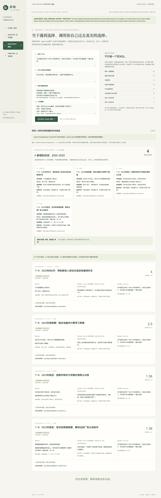

# 叙能 / Tell Me More

[](https://github.com/swordluan8-hash/tell-me-more/actions/workflows/ci.yml)

A single-user prototype governed by [PRODUCT_SPEC_V2.md](PRODUCT_SPEC_V2.md).

**Tell Me More (叙能) is an intelligent system that triggers authentic memories through real objects, uses a proactive AI Agent to reconstruct real decision-making processes through interviews, accumulates authentic personal data over time, and uses algorithms to analyze and empower.**

Three non-negotiable “real” layers:

- **real objects / 真实物件**
- **real memories / 真实回忆**
- **real decisions at that time / 真实当时决策**

Core chain: **object → memory → decision → data → analysis → empowerment**.

The Agent records, organizes, compares and presents. **The final choice always remains with the user.**

## Sanity Challenge 2026 · Path One

This repository is the submission codebase for **Path One: Ship an Agent That
Queries Real Content**.

- **Live public review:** https://tell-me-more-web.vercel.app/
- **DEV submission:** https://dev.to/sword_luan_6dfb4e81cf5f15/tell-me-more-an-agent-that-queries-your-past-without-letting-hindsight-rewrite-it-2f0n
- **Sanity project ID:** `3tdecpiq`
- **Knowledge Base ID:** `kbrqT3iILYmW`
- **Retrieval:** Sanity Context MCP backed by the Knowledge Base
- **Structured source of truth:** sealed Sanity documents with explicit provenance
- **Safety boundary:** historical outcomes and later evaluations never enter
  candidate matching or similarity features

The product must make six things work together:

1. **real artifacts**;
2. **traceable personal history**;
3. **active gap interviews**;
4. the user's **best decision at that time**;
5. **structured sealing**;
6. **similar-history Empowerment**.

Empowerment is not the first answer. It is a **second reference**: the Agent retrieves the user's own history, shows past choices, reasons, outcomes, later evaluations, similarities, differences and sources, and gives the decision back to the user.

### Why structured content matters

A keyword-search memory app could flatten the past into prose. This demo cannot:
it must keep the **original artifact**, **verbatim recall**, **decision-time
conditions**, **actual choice**, **later outcome**, **later evaluation**,
**cognition plane**, and **append-only supplements** separate and source-linked.

That separation is what lets the agent:

1. retrieve semantically through Sanity Context / Knowledge Base;
2. compare only information that was available at decision time;
3. exclude future outcomes from matching;
4. distinguish a user's explicit “I don't know” from missing data;
5. append later recall without rewriting sealed history; and
6. show the exact source behind every displayed historical claim.

```mermaid
flowchart LR
    U[User / current decision] --> W[Next.js workflow]
    W --> C[Current decision features]
    C --> MCP[Sanity Context MCP]
    MCP --> KB[Knowledge Base]
    KB --> R[Candidate historical events]
    R --> CL[Sealed Content Lake records]
    CL --> X[Deterministic pre-decision reranking]
    X --> EA[Empower Analysis V1]\n    EA --> V[Decision improvement + cognition/capability evidence + provenance]\n    V --> U

    A[Artifact / later-recall anchor] --> I[Interview + gap audit]
    I --> S[Confirmed append-only archive]
    S --> CL
```

### Real-history public proof

The challenge build now uses the owner's **real personal history**, publicly disclosed with explicit authorization for judging.

Verified public corpus:

- **121 real personal-history documents**
- **23 structured historical events**
- **54 verbatim memory statements**
- **15 artifacts / life anchors**
- **1 real T0 baseline**
- **0 synthetic event records remaining in the public dataset**

The Archive page includes a **Full Verbatim Corpus** for all 54 saved memory statements, including records that have not yet been linked to a structured event.

The fixed public Empower question comes from the owner's real May 28 session. The live result is currently:

- `retrievalMode = context`
- 18 historical candidates returned by the current real Knowledge Base / Context retrieval
- 4 structured matches retained for the current decision

### Empower Analysis V1

Context recall is **not** the final Empower output. After recall and structured reranking, `Empower Analysis V1` converts the matched personal history into current decision support.

Current real-session output:

- **7 / 8 current decision dimensions recorded**; the missing dimension is role / responsibility position;
- **4 current visible paths vs a maximum of 2 explicitly recorded in the matched historical events** — evidence of wider visible-option breadth, not a global “growth score”;
- **4 matched historical cognition planes compared with T0**;
- **5 decision-improvement actions** generated from the owner’s own history and current evidence;
- separate **cognition empowerment** and **capability empowerment** sections;
- every action links back to a historical event or verbatim current evidence.

The five current decision-improvement actions are:

1. complete the current role / responsibility position;
2. replace early-feeling judgments with explicit validation conditions;
3. stage investment instead of making one large commitment before validation;
4. do not treat the familiar old path as automatically safe;
5. turn the chosen direction into an executable first step with explicit tool gaps.

These are **process improvements**, not a final A/B choice. The user still decides.

Implementation spec: [`EMPOWER_ANALYSIS_V1.md`](EMPOWER_ANALYSIS_V1.md)








## Run

Node 22.12+ (verified with 26.8.1), npm. Next.js 16.3.5 / Sanity Studio 6.15.0.

```sh
npm ci
npm run dev                    # http://127.0.0.1:3000
npm run studio                 # http://localhost:3333
npm run lint
npm run typecheck
npm test
npm run build
npx playwright install chromium
npm run test:e2e               # starts an isolated local-demo server and never writes production
```

Local development accepts localhost requests. The internet-facing review build is read-only but now exposes the owner's real personal-history corpus with explicit authorization. It is not a general authenticated multi-user service.
The local product UI is Chinese. Judge mode uses English-first bilingual guidance for the product loop: real object → real memory → real decision → data → analysis → Empower.

## Demo walkthrough

1. Open the live review build and confirm **REAL PERSONAL HISTORY · OWNER AUTHORIZED PUBLIC DISCLOSURE**.
2. Open **Archive** and inspect the real sealed historical events.
3. Scroll to **Full Verbatim Corpus** and open any of the 54 saved `memoryStatement` records to see the exact recorded words.
4. Compare the verbatim layer with the structured event/classification layer; the system does not present classifications as if they were original quotes.
5. Open **Empower**. The fixed public decision is the owner's real May 28 decision after ending roughly a decade of ride-hailing.
6. Run the live Context query. The current verified path reports `retrievalMode = context`, 18 current Context candidates, and 4 retained structured matches.
7. Read **Empower Analysis V1** first: cognition empowerment, capability empowerment, current decision gaps, option-breadth change, and the five evidence-linked decision-improvement actions.\n8. Read **Personal History Basis**: past choice, reason, actual outcome, later evaluation when recorded, and source event ID.\n9. Expand a match to inspect field-level similarities, differences, weights, and provenance.\n10. **Cognition Timeline** remains descriptive; it does not generate a growth score.

Current verification: **56 deterministic/unit rule tests pass, 4 browser E2E flows pass, typecheck/lint/build pass, GitHub CI passes, and the public Vercel deployment passes.**

The public Content Lake now contains the owner-authorized real archive: **121 documents / 23 historical events / 54 verbatim memory statements / 15 artifacts or anchors / 1 T0 baseline**.

## Sanity and Context

Provisioned project: **3tdecpiq**, dataset: **production**. The project is now
attached to the user's Sanity organization. Content Lake readback is live. A hosted
Studio is deployed at `https://tell-me-more-xu-neng.sanity.studio/`, and its schema
deployment has been verified.

Credentials live only in `sanity/.env.local` (see `.env.example`). Server code reads
that file; tokens are never shipped in frontend environment variables.

```sh
npm run seed                   # create missing fixture IDs only; never replace
npm run verify:sanity          # prints only safe project/retrieval status
npm run schema:deploy
```

**Sanity Context + Knowledge Base are verified.** Context is installed for the
organization, an organization-level Context Viewer token has been provisioned, and
the hosted Studio/schema prerequisite is deployed. The submission demo uses the
organization MCP endpoint backed by Knowledge Base `kbrqT3iILYmW`:

```dotenv
SANITY_CONTEXT_MCP_URL=https://api.sanity.io/v1/context/organizations/ok578v8vm/mcp/tell-me-more
SANITY_KNOWLEDGE_BASE_ID=kbrqT3iILYmW
```

The production MCP exposes `initial_context` and `knowledge_base_read`. Tokens
remain only in gitignored `sanity/.env.local`.

The Knowledge Base dataset source deliberately projects only decision-time structure:
event context, role, known information, visible options, constraints/resources,
technology limits, decision nodes, chosen action, historical-best statement and the
user's reason. Outcome, later evaluation, reflection and later-learned fields are not
ingested. Context retrieves candidate historical material; the application then
maps it back to sealed Content Lake records and performs its own deterministic
pre-decision similarity reranking. KB prose is not used as a final recommendation.
MCP failures still produce an explicit Content Lake fallback.

The public Content Lake now contains **121 owner-authorized real personal-history documents**. The Knowledge Base dataset import selects `demo == false` historical events and ingested **23 / 23 real sealed events with 0 ingestion failures**.

The Knowledge Base build completed successfully. It currently reports **2 review issues**, so this README does not claim that every historical record is semantically complete. **Path One Knowledge Base-backed Context retrieval is verified by the live public Empower path (`retrievalMode = context`).**

References verified on 2026-09-22:
[AI coding-agent quickstart](https://www.sanity.io/docs/getting-started/ai-coding-agents),
[provisioning](https://sanity.new),
[Context setup](https://www.sanity.io/docs/ai/sanity-context-quick-start),
[Context tool contract](https://www.sanity.io/docs/ai/sanity-context-mcp-tools).

## Public judge deployment mode

The internet-facing review build is intentionally **read-only**, but the data is real rather than synthetic. The owner explicitly authorized public disclosure for this challenge.

- all 121 current public archive documents are `demo == false` real personal-history records;
- the three old synthetic partnership events have been removed;
- all 54 saved verbatim memory statements are inspectable in the UI;
- public artifact/T0/seal/recall/gap-write actions are rejected;
- the public Empower button runs the real May 28 current decision through Sanity Context / Knowledge Base;
- the returned Empower session is not persisted;
- the Context organization token remains server-side.

One imported lending/investment event contains **22 provenance references** to two child-record IDs that the earlier import workflow never created. Those references are retained as weak Sanity references; no missing record was fabricated.

## Local fallback and privacy

```sh
TMM_STORAGE=local-demo npm run dev
```

The local create-only archive is `.data/archive.json` (gitignored, mode 0600).
The local owner archive remains available in `.data/archive.json`. For this challenge, the same authorized real corpus is also published to the Sanity `production` dataset. Public mode remains read-only. Local data is not encrypted at rest. A separate audited user deletion/export workflow and multi-user authentication are outside this slice.

## Similarity and archive guarantees

Weights: domain 20, role 15, goal 15, constraints/resources 15, options 15,
information 10, relationships 5, technology 5. Each component is exact normalized
word-set Jaccard overlap × its weight. Unknown dimensions contribute zero and
reduce coverage; scores are not normalized upward. Outcomes, later evaluations,
and later-learned information never enter matching or candidate queries.

The four current inputs directly index domain, urgency constraints, and options.
Other dimensions remain unknown unless explicitly labeled in the user's text:
`角色：…；目标：…；信息：…；关系：…；技术：…`.
This lexical method intentionally misses synonyms; it does not fabricate facts.

The repository exposes only `all` and `append`. Duplicate IDs fail; no patch,
replace, or delete path exists. API PATCH/DELETE return 405. Studio is read-only
with all mutation actions disabled. Sanity administrators or a stolen broad write
token can still modify documents outside this application; this is business-layer
immutability, not provider-enforced WORM storage.

## Structure and limitations

- `web/`: Next.js App Router, local-only API, responsive workflow UI.
- `sanity/`: standalone read-only Studio and six structured document schemas.
- `packages/domain/`: Zod contracts, interview protocol, deterministic comparisons.
- `packages/storage/`: create-only local/Sanity repositories and Context adapter.
- `packages/application/`: use-case orchestration; no generic chat endpoint.
- `tests/`: constitutional rules and desktop/mobile browser verification.

Image mode seals metadata and a file-content hash; original image bytes remain on
the user's device. No OCR, image understanding, audio or video processing. Drafts
remain in React memory until seal and are lost on refresh. The UI currently creates
one decision node per interview; the model and archive viewer support multiple.
Historical plane reconstruction is seeded and sourced, not automatically inferred.
The local JSON store serializes writes within one server process; it is not a
multi-process production database. No submission video has been made.
